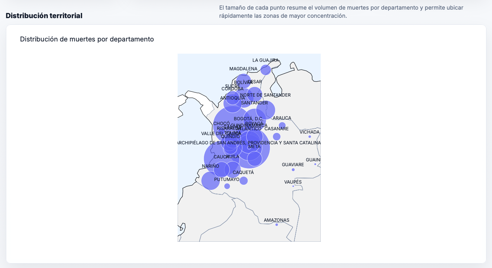
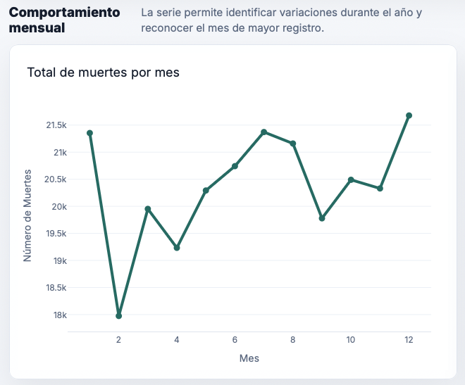
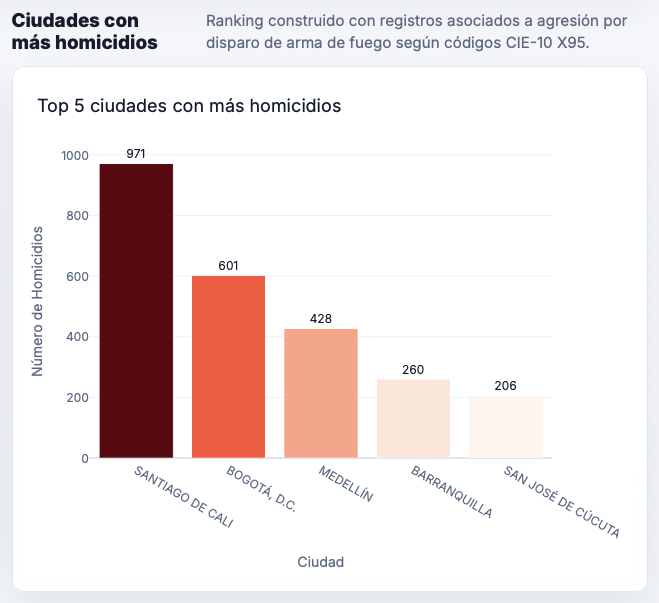
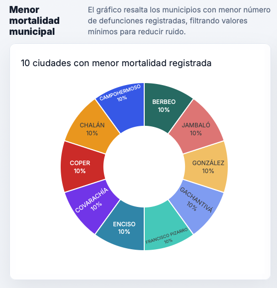
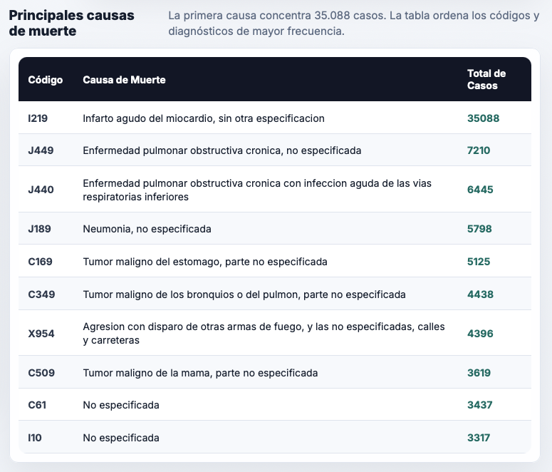
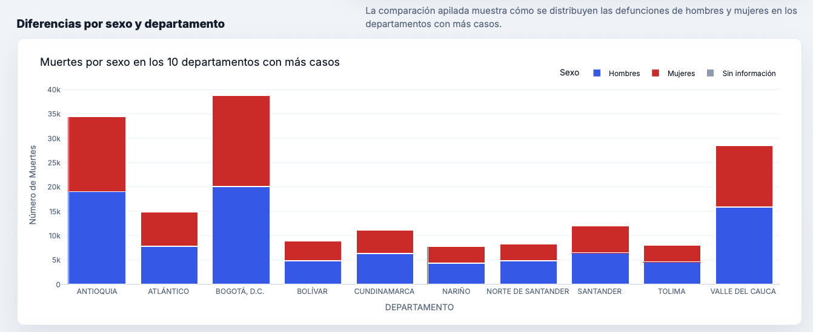
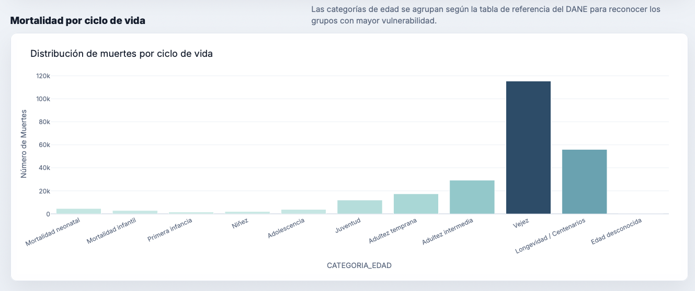

# Dashboard de Mortalidad en Colombia - 2019

## Introducción
Este proyecto presenta un dashboard interactivo desarrollado con Dash y Plotly para analizar los patrones de mortalidad en Colombia durante el año 2019. La aplicación permite explorar visualmente la distribución geográfica, temporal, etaria y por causa de las defunciones registradas por el DANE.

## Objetivo
Identificar patrones demográficos y regionales de mortalidad en Colombia mediante visualizaciones interactivas que faciliten la interpretación de los datos y apoyen la toma de decisiones en salud pública.

## Estructura del proyecto

```text
dashboard-mortalidad-colombia/
├── src/
│   └── app.py            # Aplicación principal Dash
├── data/                 # Archivos de datos fuente
├── assets/               # Estilos CSS personalizados e imágenes
├── requirements.txt      # Dependencias del proyecto
├── render.yaml           # Configuración para despliegue en Render
└── README.md             # Documentación del proyecto
```

## Requisitos
- Python 3.11 o superior
- Librerías: dash, plotly, pandas, openpyxl, gunicorn

## Instalación y ejecución local
1. Clonar el repositorio:
   ```bash
   git clone https://github.com/Aramendiz/dashboard-mortalidad-colombia.git
   cd dashboard-mortalidad-colombia
   ```

2. Crear y activar entorno virtual:

```bash
python -m venv venv
source venv/bin/activate  # En Windows: venv\Scripts\activate
```

3. Instalar dependencias:

```bash
pip install -r requirements.txt
```

4. Ejecutar la aplicación:

```bash
python src/app.py
```

5. Abrir el navegador en http://127.0.0.1:8050

### 🚀 Para desplegar en Render

1. **Sube todo** a un repositorio de GitHub.
2. **Crea una cuenta** en render.com.
3. **Haz clic** en "New +" → "Blueprint".
4. **Conecta** tu repositorio.
5. **Render leerá** render.yaml y desplegará automáticamente.
6. **Recibirás** una URL pública como: https://dashboard-mortalidad-colombia-5b7n.onrender.com

### Visualizaciones y resultados

### Mapa de mortalidad por departamento

<div align="center">
  
</div>

El mapa muestra la distribución geográfica de las muertes. Se observa una mayor concentración en departamentos densamente poblados como Antioquia, Valle del Cauca y Cundinamarca.

### Gráfico de líneas por mes

<div align="center">
  
</div>

Revela la variación estacional de las defunciones, con picos en meses específicos que podrían asociarse a fenómenos climáticos o epidemiológicos.

### Top 5 ciudades más violentas

<div align="center">
  
</div>

Identifica las ciudades con mayor número de homicidios (código X95), destacando las principales urbes del país.

### Ciudades con menor mortalidad

<div align="center">
  
</div>

Muestra las localidades con menor número de defunciones, útil para estudios de factores protectores.

### Tabla de causas de muerte

<div align="center">
  
</div>

Lista las 10 causas más frecuentes, permitiendo identificar las principales amenazas para la salud pública.

### Barras apiladas por sexo y departamento

<div align="center">
  
</div>

Compara la mortalidad entre hombres y mujeres en cada departamento, evidenciando diferencias significativas por género.

### Histograma por ciclo de vida

<div align="center">
  
</div>

Distribuye las muertes según las categorías etarias definidas por el DANE, mostrando los grupos de mayor vulnerabilidad (vejez, adultez intermedia, mortalidad neonatal).

### Software utilizado

Python 3.11
Dash 2.14
Plotly 5.18
Pandas 2.1
Bootstrap 5
Gunicorn (servidor de producción)

### Autores

```text
- Jairo Teófilo Araméndiz Pinzón
- Luz Aida Blandon Caicedo
- Fabio Gomez Estepa
```